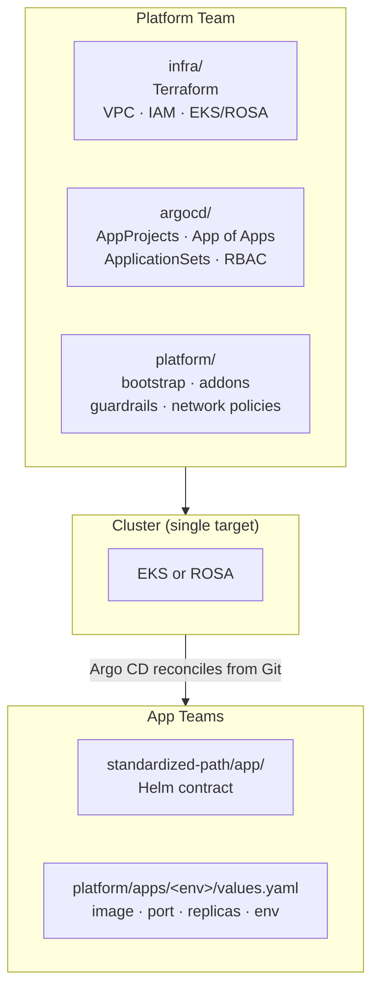

# Multi-Cloud Internal Developer Platform (EKS + OpenShift)

A portable internal developer platform built for Amazon EKS and Red Hat OpenShift (ROSA). Designed to give application teams a single golden path for deploying services while platform teams maintain security, consistency, and GitOps-driven operations.

---

## What this demonstrates

- **Platform-as-product thinking** — clear separation between platform team (infra, GitOps, guardrails) and app teams (Helm values only)
- **Cluster-portable contract** — same Helm chart, same GitOps model, same CI pipeline works on EKS and OpenShift; toggle with one values flag
- **Admission-level security** — OpenShift SCC enforced at cluster level vs. overridable `securityContext` on EKS, with automatic handling in templates
- **GitOps discipline** — Argo CD app-of-apps pattern, drift detection, environment promotion via Git, no `kubectl apply` for steady state
- **3 environments** — dev → stage → prod promotion through reviewed PRs with increasing replica counts and resource quotas
- **Built-in observability** — Prometheus + Grafana with pre-built dashboards, auto-discovered via ServiceMonitor
- **Secret management** — External Secrets Operator with ClusterSecretStore and Helm-integrated ExternalSecret template
- **9 CI checks** — Terraform fmt/validate/lint, Trivy scan, Helm lint, manifest rendering, kubeconform, OPA policy validation, OpenShift structural validation

---

## Quickstart

```bash
# Prerequisites: kind, docker, kubectl, helm, conftest (see below)

# One command — creates cluster, installs Argo CD, deploys platform + demo app
make setup
```

Or step by step:

```bash
make kind-up                    # Create local Kind cluster
make validate                   # Run CI checks locally (no cluster needed)
make argocd-install             # Install Argo CD + AppProjects
make deploy                     # Bootstrap + add-ons + demo app
make clean                      # Delete cluster
```

**Prerequisites:**

| Tool | Install |
|---|---|
| Docker | [docs.docker.com/engine/install](https://docs.docker.com/engine/install/) |
| kind | `go install sigs.k8s.io/kind@latest` |
| kubectl | `curl -LO "https://dl.k8s.io/release/$(curl -L -s https://dl.k8s.io/release/stable.txt)/bin/linux/amd64/kubectl"` |
| Helm | `curl https://raw.githubusercontent.com/helm/helm/main/scripts/get-helm-3 \| bash` |
| conftest | `wget "https://github.com/open-policy-agent/conftest/releases/latest/download/conftest_$(uname -s)_$(uname -m).tar.gz" && tar xzf conftest_*.tar.gz && sudo mv conftest /usr/local/bin/` |

---

## Architecture



## Contract: What app teams provide vs. what the platform guarantees

**App teams provide** (in `platform/apps/<env>/values.yaml`):

```
image, port, replicas, ingress rules, env vars, resource requests
```

**Platform guarantees** for every deployment:

| Guarantee | Mechanism |
|---|---|
| Non-root execution | `securityContext` on EKS, SCC on OpenShift |
| Dropped capabilities | `drop: [ALL]` on EKS, default SCC on OpenShift |
| Resource boundaries | LimitRange + ResourceQuota per namespace |
| Network isolation | Default-deny network policies per namespace |
| Drift detection | Argo CD self-healing from Git |
| Immutable tags | CI rejects `latest` image tags and `HEAD` revisions |
| Cluster portability | Same chart works on EKS and OpenShift (`openshift.enabled`) |

---

## Security: EKS vs. OpenShift

On EKS, security relies on pod-level `securityContext` — which any chart consumer can override. On OpenShift, SecurityContextConstraints (SCC) enforce policy at admission and cannot be bypassed.

| Concern | EKS | OpenShift |
|---|---|---|
| Root enforcement | Pod spec field (overridable) | SCC (mandatory) |
| UID | Must specify `runAsUser: 1000` | Random UID assigned by SCC |
| Capabilities | Must write `drop: [ALL]` | Dropped by default |
| Trust boundary | The pod spec | The cluster admission controller |

The chart detects the target automatically: when `openshift.enabled=true`, pod-level `securityContext` is omitted to avoid conflicts with SCC.

---

## Observability

Prometheus and Grafana are deployed as Argo CD-managed add-ons with a pre-built **Platform App Overview** dashboard covering CPU, memory, request rate, and pod status across all environments.

| Component | Data source | How it's discovered |
|---|---|---|
| Prometheus | kube-prometheus-stack | ServiceMonitor with label `app.kubernetes.io/managed-by: platform` |
| Grafana | Prometheus | Dashboard ConfigMap auto-loaded via provider config |
| Metrics | kube-state-metrics + cAdvisor | Default kube-prometheus-stack scrape configs |
| App metrics | `/metrics` endpoint | ServiceMonitor template in the Helm chart (enabled by default) |

Every app deployed through the platform contract automatically gets a ServiceMonitor — teams don't need to configure scraping.

---

## Key decisions

| Decision | Why |
|---|---|
| Argo CD over Flux | Already present in repo; single controller avoids drift between reconcilers |
| Helm as the contract format | Mature, lintable, env-overridable values; app teams already know it |
| Single chart promoted through envs | One chart + three values files = stable packaging, explicit promotion |
| `openshift.enabled` flag, not separate chart | Proves the contract is truly portable, not a copy-paste per cluster |
| No ROSA Terraform module | The infrastructure provider is an implementation detail; the contract is what matters |

---

## What I'd do next

- Add OPA/Gatekeeper policies for platform-level validation beyond what SCC provides
- Replace `legacy/` assets with a clean `examples/` directory

---

## Repo layout

```
Makefile              # One-command setup: kind cluster, Argo CD, deploy, validate, clean
kind-config.yaml      # Kind cluster configuration with port mappings
argocd/               # AppProjects, app-of-apps, ApplicationSets, config, bootstrap
infra/                # VPC, IAM, EKS (Terraform modules)
platform/             # Namespaces, quotas, network policies, add-ons, Grafana dashboards, env overrides
standardized-path/    # Golden path Helm chart (the tenant contract)
policy/               # OPA/Rego policies for EKS and OpenShift security validation
docs/                 # Architecture, operations, tenant contract
```

---

## Running CI

All validation runs on push/PR. Run locally:

```bash
make validate
```

Individual checks:

```bash
helm lint standardized-path/app -f platform/apps/dev/values.yaml
helm template test standardized-path/app | kubeconform -summary
helm template test standardized-path/app \
  --set openshift.enabled=true \
  --set openshift.route.enabled=true \
  --set ingress.enabled=false \
  | grep "kind: Route"
```
